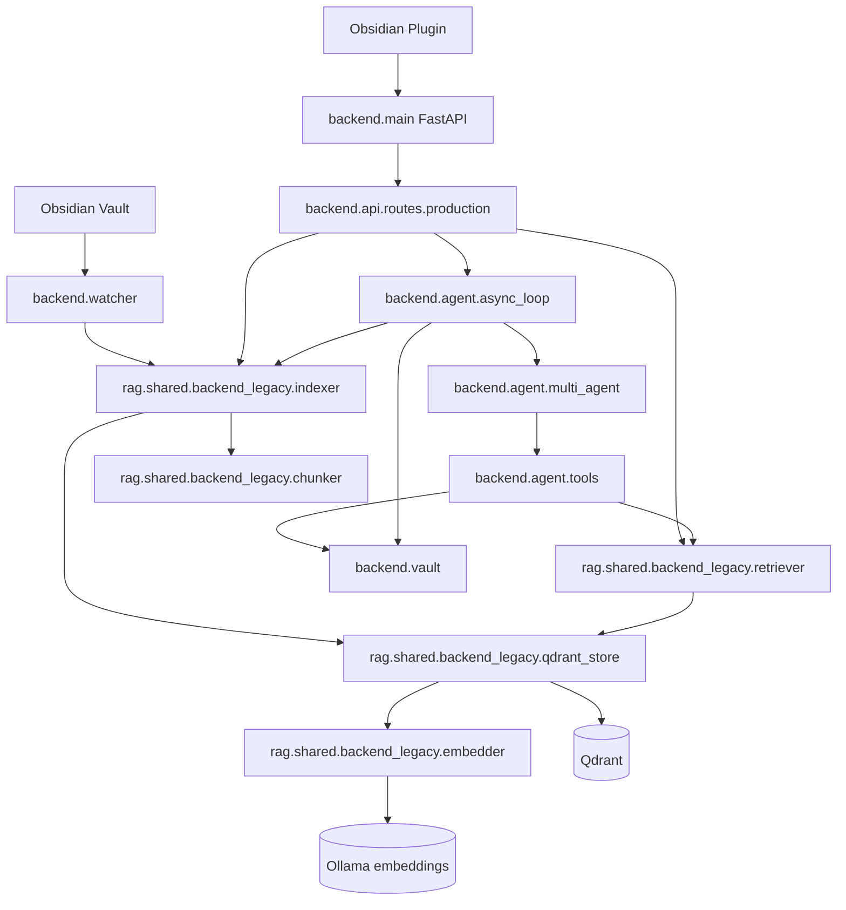
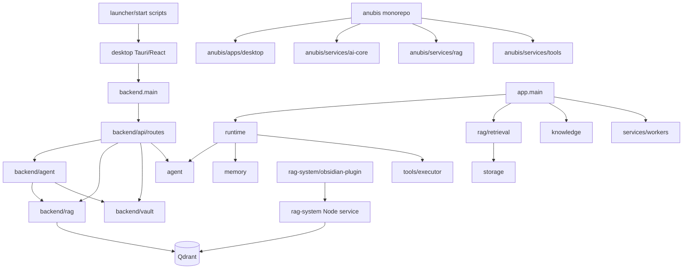

# Anubis Repository Architecture Audit

Date: 2026-06-02

Target architecture:

```text
Obsidian vault/plugin -> FastAPI -> autonomous agents -> Qdrant memory
```

The current repository contains three overlapping systems:

- `backend/*`: the most aligned implementation for the target architecture.
- root legacy stack: `app/`, `api/`, `runtime/`, `agent/`, `memory/`, `retrieval/`, `knowledge/`, `rag/`, `storage/`, etc.
- `anubis/*`: a newer monorepo-style service split with desktop, ai-core, rag, tools, packages, and kernel.

Recommendation: make `backend/` plus the Obsidian plugin the canonical product, migrate only useful ideas from the other two systems, then delete/archive desktop and duplicated service experiments.

## Inventory

| Folder | Purpose | Main dependencies | Current usage | Referenced by |
|---|---|---|---|---|
| `.agents/` | Local agent/skill metadata. | None observed. | Operational metadata, not app runtime. | None observed. |
| `.github/` | CI/workflow metadata. | GitHub Actions. | Keep if CI exists. | GitHub only. |
| `.venv/` | Local Python virtualenv. | Installed Python packages. | Generated local environment. | Should not be source-controlled. |
| `agent/` | Legacy autonomous coding-agent stack: planner, coder, reviewer, tester, debugger, self-improvement, skill graph. | `core`, `memory`, `tools`, `llm`, `runtime`. | Still exercised by `tests/test_loop_autonomy.py`; indirectly used by root `runtime`. Also imported by `backend/api/routes/brain.py` and `backend/api/routes/skills.py`. | `runtime/agent_runner.py`, `backend/api/routes/brain.py`, `backend/api/routes/skills.py`, tests. |
| `anubis/` | Experimental monorepo: desktop app, kernel, services, packages, docs, infra. | FastAPI, Qdrant, Tauri, React, local packages. | Not wired into root `Makefile` or canonical `backend.main`. Mostly isolated. | Internal imports only. |
| `anubis/apps/desktop/` | Duplicate Tauri/React desktop app. | Tauri, React, Vite. | Obsolete under Obsidian-first target. | Internal desktop build only. |
| `anubis/kernel/` | Minimal packaged FastAPI agent kernel. | FastAPI, pydantic. | Useful reference, isolated from canonical backend. | Internal `anubis_kernel` imports only. |
| `anubis/services/ai-core/` | Service-oriented AI core/orchestrator prototype. | FastAPI, httpx, structlog, local packages. | Duplicates `backend/agent` and `backend/api`. Not integrated. | Internal imports only. |
| `anubis/services/rag/` | Service-oriented RAG/Qdrant prototype with security filters. | FastAPI, Qdrant, httpx, structlog. | Duplicates `backend/rag`; security ideas are useful. Not integrated. | Internal imports only. |
| `anubis/services/tools/` | Tool runner/sandbox prototype. | FastAPI, httpx, pydantic. | Duplicates `backend/tools` and root `tools`. Not integrated. | Internal imports only. |
| `anubis/packages/*` | Shared types, memory SDK, prompt engine. | TypeScript or pydantic. | Premature packaging for current minimal architecture. | Only `anubis/services/*` references. |
| `api/` | Legacy FastAPI route modules and OpenAI-compatible HTTP server. | `runtime`, `rag`, `knowledge`, `crawler`, `services`, `workers`. | Superseded by `backend/api/routes/*` for current architecture. | Mostly root `app/main.py`; not mounted by `backend.main`. |
| `app/` | Legacy FastAPI entrypoint exposing OpenAI-compatible API plus crawler, RAG, Qdrant, vault, cache. | `runtime`, `retrieval`, `knowledge`, `crawler`, `services`, `workers`, `storage`. | Dockerfile still starts `app.main:app`; conflicts with `Makefile` backend target. | `main.py`, `cli/app.py`, Dockerfile. |
| `assets/` | Icons. | SVG assets. | Useful for branding/docs, not runtime critical. | Desktop/launcher likely. |
| `backend/` | Current canonical Python backend: FastAPI, vault, RAG/Qdrant, watcher, agent, skills, sandbox. | FastAPI, pydantic, qdrant-client, watchdog, requests. | Best aligned with target. `Makefile backend` runs `backend.main:app`; tests cover production endpoints. | `scripts/*`, tests, itself. |
| `backend/api/routes/production.py` | `/ask`, `/sync`, `/memory`. | `backend.agent.async_loop`, `rag.shared.backend_legacy`. | Canonical public API for target architecture. | `backend/main.py`, tests. |
| `backend/api/routes/desktop.py` | Desktop/library/assistant convenience routes. | `backend.agent.loop`, `rag.shared.backend_legacy`, vault. | Obsolete as desktop surface; can be merged into Obsidian plugin API or removed after migration. | `backend/main.py`, tests. |
| `backend/api/routes/local.py` | Local file/read/write/embed/agent routes. | `rag.shared.backend_legacy`, vault, agent. | Useful during development but duplicates production routes. | `backend/main.py`, tests. |
| `backend/api/routes/brain.py` | React desktop dashboard snapshot/log/WebSocket surface. | `agent.multi_agent`, skill graph, Qdrant status. | Desktop-specific and imports legacy `agent`. | `backend/main.py`, tests. |
| `backend/api/routes/skills.py` | Skill graph API. | legacy `agent.skill_ecosystem_graph`. | Useful concept, wrong dependency boundary. | `backend/main.py`, `brain.py`, tests. |
| `backend/agent/` | Current local agent loop, async planner/executor/critic loop, LLM adapter, tools, meta-agent. | `rag.shared.backend_legacy`, `backend.vault`, `backend.skills`, `backend.tools`. | Keep as reasoning layer. | `backend/api/routes/*`, scripts. |
| `backend/rag/` | Current chunk/embed/index/search Qdrant integration. | qdrant-client, requests/Ollama, vault. | Keep as memory layer. | `backend.agent`, `backend.api`, watcher, scripts. |
| `backend/vault/` | File-based vault service and markdown section parsing. | `backend.core`. | Keep as file truth adapter. | `rag.shared.backend_legacy`, `backend.agent`, routes. |
| `backend/watcher/` | Watchdog Markdown watcher and incremental sync state. | watchdog, `rag.shared.backend_legacy`. | Keep for real-time Obsidian ingestion. | `backend.main`, scripts. |
| `backend/skills/` | Markdown skill repository and skill-generation engine. | vault, RAG, LLM. | Keep/refactor into memory/agent layer. | `backend.agent`, scripts. |
| `backend/tools/` | Minimal sandbox executor. | config, paths. | Keep if agents can call shell/tools; otherwise isolate behind explicit permission. | `backend.agent.tools`, `backend.agent.multi_agent`. |
| `cli/` | Legacy terminal UI for root runtime. | `app.main`, `runtime`, `memory`, `llm`. | Obsolete if Obsidian plugin is primary UI. | `anubis_cli.py`, tests indirectly. |
| `core/` | Legacy shared contracts/logging/workspace paths. | Stdlib. | Used by legacy root stack. Some concepts useful. | `agent`, `runtime`, `memory`, `tools`, `knowledge`. |
| `crawler/` | Web crawler and extraction pipeline. | `rag.service`, fetch/parser/scoring. | Outside target architecture unless web ingestion is a plugin skill. | root `app`, `workers`, `services`. |
| `desktop/` | Main Tauri/React desktop app, built assets, node_modules, Rust target. | Tauri, React, Vite, Tailwind, D3, Cytoscape. | Obsolete under no-standalone-desktop decision. | `Makefile desktop`, scripts, launcher docs. |
| `docker/` | Entrypoint for Dockerfile. | shell, app entrypoint. | Currently tied to legacy `app.main`. | Dockerfile. |
| `docs/` | Architecture/product docs, many desktop-oriented. | Markdown. | Keep selectively; update to Obsidian-first architecture. | Human reference. |
| `executor/` | Legacy tool execution abstraction. | Stdlib. | Used by root `runtime/plugins.py` and `runtime/tool_registry.py`. | legacy runtime. |
| `frontend/` | README placeholder. | None. | Obsolete. | None observed. |
| `infra/` | Dockerfiles, compose, Qdrant config, scripts. | Docker, shell. | Useful only after pruning service model; currently duplicates root compose and `anubis/infra`. | operator scripts. |
| `intelligence/` | Small text analysis service. | Stdlib. | Legacy API extra, outside target. | root `app`, `services`. |
| `knowledge/` | Legacy Obsidian ingestion/maintenance pipeline. | `memory`, `retrieval`, `storage`. | Duplicates `backend/rag` and `backend/vault`. | root `app`, `services`, workers. |
| `launcher/` | Desktop launcher manifest/docs. | Tauri/service manager. | Obsolete with desktop removal. | human/docs only. |
| `llm/` | Legacy Ollama adapter. | requests likely. | Used by root runtime/retrieval/CLI; duplicates `backend.agent.llm`. | root `runtime`, `retrieval`, `cli`. |
| `memory/` | Legacy JSON/vector/Hermes memory store. | filesystem, `core`. | Duplicates Qdrant/vault memory; tests cover legacy behavior. | root `agent`, `runtime`, `knowledge`, `tools`, `retrieval`. |
| `monitoring/` | Legacy metrics aggregation. | `knowledge`, `retrieval`, `services`, `storage`. | Useful idea, wrong stack. | root `app`, `api/routes/admin.py`. |
| `rag/` | Legacy RAG facade over `retrieval`. | `retrieval.service`. | Duplicates `backend/rag`. | root `app`, workers, api routes. |
| `rag-system/` | Node/Express RAG service plus Obsidian plugin. | Express, dotenv, fast-glob, gray-matter, Qdrant, Obsidian plugin tooling. | Obsidian plugin is important; Node RAG service duplicates Python backend. | Plugin posts to Node `/sync` by default. |
| `retrieval/` | Legacy hybrid retrieval, embedding pipeline, Qdrant engine, query planning. | `memory`, `storage`, `llm`, `services`. | Contains useful retrieval ideas but duplicates `backend/rag`. | root `rag`, `knowledge`, workers. |
| `runtime/` | Legacy agent composition/runtime/tool registry/streaming. | legacy `agent`, `memory`, `tools`, `executor`. | Duplicates `backend/agent`; still covered by tests. | root `app`, `api/openai_server.py`, CLI. |
| `scripts/` | Setup/check/dev scripts and backend helper scripts. | shell, Python. | Mixed: backend scripts useful; desktop scripts obsolete. | operators, Makefile. |
| `services/` | Legacy service container/background/cache/health. | legacy `crawler`, `knowledge`, `rag`, `storage`, `workers`. | Superseded by current backend. | root `app`, api routes. |
| `state/` | Runtime data: logs, JSON memory, old Obsidian vault copy. | runtime-generated files. | Should not be product source except seed fixtures if intentional. | legacy memory/runtime. |
| `storage/` | Legacy Redis/Qdrant/Obsidian/keyword adapters. | requests/Redis, `memory`, `knowledge`. | Duplicates `backend/rag.qdrant_store` and `backend/vault`. | legacy retrieval/services. |
| `tests/` | Unit tests for backend desktop API and legacy autonomy loop. | unittest, FastAPI TestClient. | Useful; should be rewritten around canonical backend and Obsidian plugin contract. | test runner. |
| `tools/` | Legacy tool implementations. | legacy sandbox, memory. | Some useful actions; duplicate `backend/tools`. | root `runtime/tool_registry.py`, tests. |
| `vault/` | Current local Markdown vault with notes and skills. | Filesystem. | Keep as local development/default vault. | `backend.vault`. |
| `workers/` | Legacy background jobs. | crawler, knowledge, rag, retrieval. | Obsolete unless background ingestion remains separate from FastAPI lifecycle. | root app/services. |

## KEEP

- `backend/main.py`
- `backend/api/routes/production.py`
- `backend/api/routes/health.py`
- `backend/agent/async_loop.py`
- `backend/agent/multi_agent.py`
- `backend/agent/llm.py`
- `backend/agent/tools.py`
- `backend/rag/*`
- `backend/vault/*`
- `backend/watcher/*`
- `backend/core/*`
- `backend/skills/*`, after dependency cleanup
- `backend/tools/sandbox.py`, if autonomous tool execution remains in scope
- `scripts/ingest_obsidian.py`
- `scripts/watch_obsidian.py`
- `scripts/run_multi_agent.py`
- `scripts/run_agent.py`
- `scripts/run_skill_engine.py`
- `scripts/run_meta_agent.py`
- `vault/`
- `rag-system/obsidian-plugin/`, but retarget it to Python FastAPI
- root `docker-compose.yml`, after updating services to canonical backend
- `Makefile`, after removing desktop target
- `backend/requirements.txt`
- selected docs: `README.md`, `docs/ARCHITECTURE.md`, `docs/PRODUCTION_KNOWLEDGE_ASSISTANT.md`, rewritten around Obsidian-first design

## REMOVE

Remove after preserving any still-needed snippets in docs or migration notes:

- `desktop/`
- `anubis/apps/desktop/`
- `Anubis.desktop`
- `launcher/`
- `scripts/install_desktop_entry.sh`
- `scripts/launch_anubis_desktop.sh`
- `frontend/`
- `rag-system/src/` Node RAG service after plugin speaks to FastAPI
- `rag-system/package.json` and `rag-system/package-lock.json` after Node service removal
- root legacy API stack if not needed for compatibility: `app/`, `api/`, `services/`, `workers/`
- root legacy retrieval/memory stack after migration: `rag/`, `retrieval/`, `knowledge/`, `storage/`, `memory/`
- root legacy autonomous CLI stack after migration: `agent/`, `runtime/`, `tools/`, `executor/`, `cli/`, `anubis_cli.py`, root `main.py`
- `crawler/` unless web crawling is reintroduced as an explicit plugin/tool
- `intelligence/` unless text analysis is a concrete agent skill
- generated/runtime artifacts: `__pycache__/`, `desktop/node_modules/`, `desktop/dist/`, `desktop/src-tauri/target/`, `.venv/`, `state/*.log`, generated dev-server state
- obsolete desktop docs: `docs/DESKTOP_LAUNCHER.md`, `docs/DESKTOP_OS_REPO.md`, `docs/UI_DESIGN.md`, desktop-heavy parts of `docs/USER_FIRST_REDESIGN.md`

## MERGE

- Merge `backend/api/routes/local.py` and `backend/api/routes/notes.py` into a small Obsidian-facing vault API:
  - `GET /notes`
  - `GET /notes/{path}`
  - `PUT /notes`
  - `POST /sync`
- Merge `backend/api/routes/rag.py` into `production.py` or a single `memory.py` router:
  - `POST /memory`
  - `POST /sync`
  - optional `POST /memory/reindex`
- Merge useful ideas from `retrieval/` into `backend/rag/` only if needed:
  - query planning
  - confidence scoring
  - hybrid keyword + vector retrieval
  - context builder
- Merge useful ideas from `anubis/services/rag/security/` into `backend/rag/`:
  - memory poisoning filters
  - prompt-injection sanitization
  - retrieval safety scoring
- Merge useful agent-role definitions from root `agent/` into `backend/agent/`, then delete root `agent/`.
- Merge useful tool schemas/sandbox ideas from `anubis/services/tools/` and root `tools/` into `backend/tools/`.
- Merge `backend/api/routes/skills.py` with `backend/skills/` so it no longer imports legacy `agent.skill_ecosystem_graph`.
- Merge root and backend requirements into one canonical `requirements.txt`, or keep only `backend/requirements.txt`.

## REFACTOR

- Retarget Obsidian plugin:
  - current default: `http://127.0.0.1:8787/sync`
  - target default: `http://127.0.0.1:8000/sync`
  - add `/ask` command and `/memory` lookup command against FastAPI.
- Replace plugin bulk note payload with one of:
  - filesystem watcher as primary sync, plugin only triggers `/sync`
  - or add FastAPI endpoint accepting plugin note payloads if browser sandbox cannot expose vault path.
- Remove `backend/api/routes/desktop.py` from default router mount. Keep only as temporary compatibility if tests/users still depend on it.
- Remove `backend/api/routes/brain.py` or rename/rebuild as a lightweight `/status` API without React/Tauri assumptions.
- Make `backend.main` the only FastAPI app. Dockerfile currently starts `app.main:app`; update it to `backend.main:app`.
- Disable watcher in tests via settings or app factory to avoid startup side effects.
- Convert `backend/main.py` from global app to `create_app()` factory for testability.
- Add a Qdrant abstraction with explicit fallback mode. Current fallback is useful for tests but should be visible in health/status.
- Move hardcoded local-only middleware and CORS config into settings.
- Normalize environment variables:
  - `ANUBIS_VAULT_PATH` / `OBSIDIAN_VAULT_PATH`
  - `QDRANT_URL`
  - `QDRANT_COLLECTION`
  - `OLLAMA_BASE_URL`
  - `ANUBIS_LLM_MODEL`
  - `ANUBIS_EMBEDDING_MODEL`
- Split agent memory writes from answer generation:
  - answer result
  - run trace note
  - durable memory note
  - Qdrant indexing
- Keep step-by-step reasoning internal in agent traces; expose summaries to API clients.

## Dead Code And Obsolete Architecture

High-confidence obsolete:

- Tauri desktop app: `desktop/`, `anubis/apps/desktop/`, `launcher/`, `Anubis.desktop`, desktop install/launch scripts.
- React/Vite dependencies: `react`, `react-dom`, `vite`, `tailwindcss`, `@tauri-apps/*`, `d3`, `cytoscape`, `lucide-react` unless a web dashboard is explicitly revived.
- Node RAG service: `rag-system/src/*` duplicates Python FastAPI + Qdrant ingestion.
- Legacy root FastAPI app: `app/main.py` duplicates `backend/main.py` and pulls in crawler/cache/legacy runtime.
- Legacy OpenAI server: `api/openai_server.py` duplicates root `app/main.py` and is not part of the target API.
- Legacy JSON/vector memory: `memory/*`, `state/hermes_memory.json`, `state/vector_store.json` once Qdrant/vault are canonical.
- Legacy crawler stack: `crawler/*` and related routes/workers unless web ingestion is a named product feature.
- Legacy service container/background stack: `services/*`, `workers/*` after backend lifecycle owns watcher/sync.

Duplicated systems:

- Agent loops:
  - `backend/agent/*`
  - root `agent/*`
  - `anubis/kernel/src/anubis_kernel/agent/*`
  - `anubis/services/ai-core/src/anubis_ai_core/agent/*`
- RAG/Qdrant:
  - `backend/rag/*`
  - root `rag/*`, `retrieval/*`, `storage/qdrant.py`
  - `rag-system/src/*`
  - `anubis/services/rag/*`
- Tool sandbox:
  - `backend/tools/sandbox.py`
  - root `tools/sandbox.py`
  - `executor/tool_executor.py`
  - `anubis/services/tools/*`
- API layers:
  - `backend/main.py`
  - `app/main.py`
  - `api/openai_server.py`
  - `anubis/kernel/main.py`
  - `anubis/services/*/main.py`
- Desktop UIs:
  - `desktop/*`
  - `anubis/apps/desktop/*`

Unused or likely unused dependencies:

- `chromadb`: no canonical usage found; Qdrant is target memory.
- `sentence-transformers`: not used by `backend/rag/embedder.py`; embeddings use Ollama with deterministic fallback.
- `redis`: only root legacy stack uses it; not required by current target unless cache remains.
- `rich`: likely CLI-only; remove with CLI stack.
- desktop dependencies: `@tauri-apps/*`, `react`, `react-dom`, `vite`, `tailwindcss`, `d3`, `cytoscape`, `lucide-react`.
- Node RAG dependencies: `express`, `fast-glob`, `gray-matter`, `dotenv` after deleting Node service.
- `structlog`, `httpx` in `anubis/services/*` if the monorepo services are removed.

## Dependency Graph

Canonical target graph:



Current repository graph, simplified:



## Proposed New Repository Structure

```text
anubis/
  backend/
    __init__.py
    main.py
    config.py
    api/
      __init__.py
      routes.py
      schemas.py
    agent/
      __init__.py
      loop.py
      roles.py
      llm.py
      tools.py
      traces.py
    memory/
      __init__.py
      qdrant.py
      embeddings.py
      retriever.py
      schemas.py
    ingestion/
      __init__.py
      markdown.py
      chunker.py
      indexer.py
      watcher.py
      sync_state.py
    vault/
      __init__.py
      service.py
      paths.py
    skills/
      __init__.py
      repository.py
      engine.py
    sandbox/
      __init__.py
      executor.py
  obsidian-plugin/
    manifest.json
    package.json
    src/
      main.ts
  scripts/
    dev_backend.sh
    ingest_obsidian.py
    watch_obsidian.py
    run_agent.py
  infra/
    docker-compose.yml
    qdrant/
      production.yaml
  docs/
    ARCHITECTURE.md
    API.md
    OPERATIONS.md
  tests/
    test_api.py
    test_agent_loop.py
    test_ingestion.py
    test_qdrant_store.py
  vault/
    notes/
    skills/
  pyproject.toml
  README.md
```

If avoiding a top-level package rename, the immediate low-risk version is:

```text
backend/
  main.py
  api/
  agent/
  core/
  rag/
  skills/
  tools/
  vault/
  watcher/
obsidian-plugin/
scripts/
infra/
docs/
tests/
vault/
```

## Migration Plan

1. Declare `backend.main:app` canonical.
2. Update Dockerfile, compose, scripts, and README to use `backend.main:app`.
3. Move `rag-system/obsidian-plugin` to `obsidian-plugin/` and point it at FastAPI.
4. Remove desktop mounts/routes from default backend:
   - `desktop.py`
   - `brain.py`
   - `Makefile desktop`
5. Add compatibility tests for:
   - `POST /sync`
   - `POST /memory`
   - `POST /ask`
   - watcher create/update/delete behavior
   - plugin sync command contract
6. Migrate useful retrieval safety pieces from `anubis/services/rag/security`.
7. Migrate useful agent-role definitions from root `agent` into `backend/agent`.
8. Delete or archive root legacy stack and monorepo experiments.
9. Clean generated artifacts and update `.gitignore`.
10. Collapse dependencies to the canonical backend + plugin dependencies.

## Final Classification

KEEP:

- `backend/`
- `vault/`
- `rag-system/obsidian-plugin/` after retargeting
- `scripts/ingest_obsidian.py`
- `scripts/watch_obsidian.py`
- `scripts/run_agent.py`
- `scripts/run_multi_agent.py`
- `scripts/run_skill_engine.py`
- `scripts/run_meta_agent.py`
- `infra/qdrant/` or root compose Qdrant service
- focused tests

REMOVE:

- standalone desktop/Tauri/React surfaces
- root legacy API/runtime/memory/retrieval stack after migration
- Node RAG service after plugin retarget
- generated artifacts and local environments

MERGE:

- retrieval safety from `anubis/services/rag/security` into `backend/rag`
- useful role/tool patterns from root `agent` and `tools` into `backend/agent` and `backend/tools`
- notes/local/rag routes into one small Obsidian/FastAPI API

REFACTOR:

- plugin -> FastAPI contract
- Dockerfile/compose -> canonical backend
- backend route boundaries
- skill graph dependency on legacy `agent`
- app factory and settings
- dependency list
